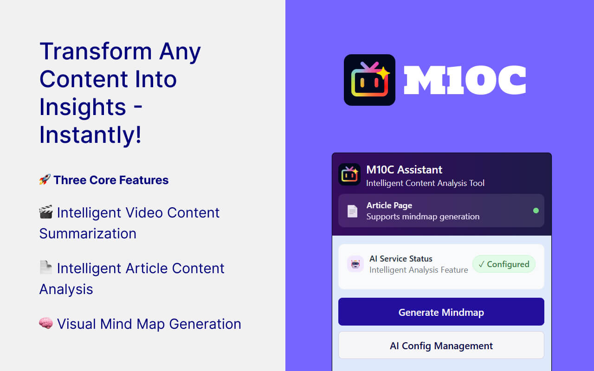
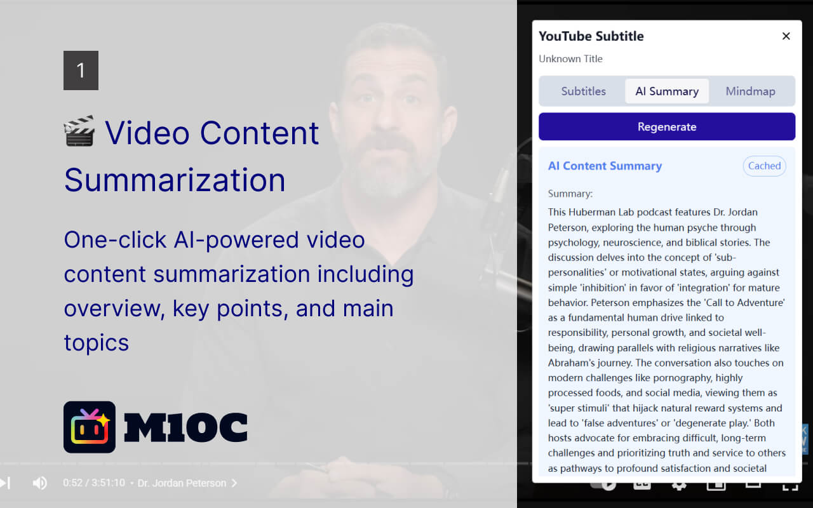
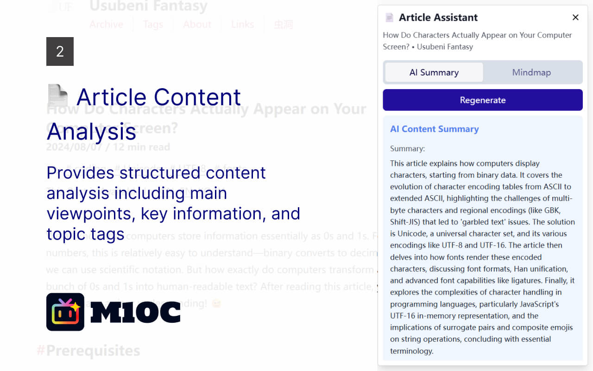
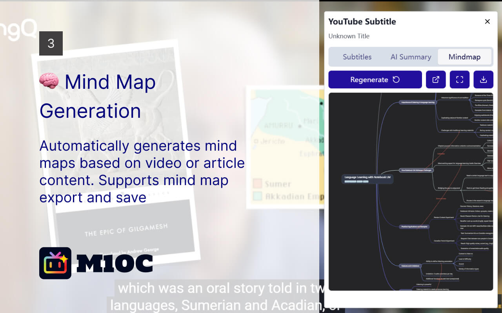

# M10C



[下载地址](https://chromewebstore.google.com/detail/ioadcalaliollffeejdkcncckkjieobp?authuser=0&hl=en)

一个可以分析视频和文章内容，生成总结和思维导图的 Chrome 插件。

## 🚀 三大核心功能

### 🎬 智能视频内容总结

**支持 YouTube 和 Bilibili 平台**

- 自动提取视频字幕内容，支持多语言字幕切换
- 一键生成视频内容的AI智能总结，包括概要、关键要点和主要话题
- 点击字幕可直接跳转到对应视频时间点，提升观看效率
- 智能缓存机制，避免重复生成，节省API调用成本



### 📄 文章内容智能分析

**全面的文本内容处理能力**

- 支持网页文章内容的自动提取和分析
- 使用多种AI服务进行内容总结和分析
- 提供结构化的内容分析，包括主要观点、关键信息和话题标签
- 支持多种AI模型选择，满足不同精度和成本需求



### 🧠 可视化思维导图生成

**将内容转化为直观的思维导图**

- 基于视频或文章内容自动生成结构化思维导图
- 支持思维导图的导出和保存功能
- 提供清晰的信息层次结构，便于理解和记忆
- 集成专业的思维导图组件，支持交互式浏览和编辑



## ✨ 技术亮点

- 🔒 **隐私安全**: API Key 仅本地存储，不上传任何服务器
- 💾 **智能缓存**: 自动保存分析结果，提升使用体验
- 🌐 **多平台支持**: YouTube、Bilibili 等主流视频平台
- ⚡ **高性能**: 优化的数据处理和渲染机制

## 配置说明

### AI服务配置

> 📖 **详细指引**: 查看 [AI服务使用指引](./guide/index.md) 获取完整的AI服务选择和配置建议

**快速推荐：**

- 🌟 **首选**: Google Gemini（免费，效果好）
- 🔄 **备选**: 硅基流动、OpenRouter
- 💰 **高级**: OpenAI GPT 或 Anthropic Claude（付费，性能最佳）

## 技术架构

### 项目结构

```
video-mindmap/
├── contents/                 # 内容脚本
│   ├── youtube-subtitle.tsx  # YouTube字幕处理
│   └── bilibili-subtitle.tsx # Bilibili字幕处理
├── utils/                    # 工具函数
│   ├── ai-service.ts        # AI服务接口
│   └── subtitle-utils.ts    # 字幕处理工具
├── config/                   # 配置文件
│   └── platforms.ts         # 平台配置
├── options.tsx              # 配置页面
├── popup.tsx                # 弹出窗口
└── package.json             # 项目配置
```

### 核心技术

- **框架**: React 18 + TypeScript
- **构建工具**: Plasmo Framework
- **存储**: Chrome Storage API
- **网络请求**: Fetch API
- **样式**: 内联样式 (避免样式冲突)

## 注意事项

### 隐私安全

- API Key 仅存储在本地浏览器中，不会上传到任何服务器
- 字幕内容仅在使用 AI 总结时发送给选择的 AI 服务商
- 插件不会收集或存储用户的个人信息

### 使用限制

- AI 总结功能需要有效的 API Key 和网络连接
- 不同 AI 服务商有不同的使用限制和计费方式
- 部分视频可能没有字幕或字幕获取失败

## 故障排除

### 常见问题

1. **字幕无法显示**

   - 检查视频是否有字幕
   - 刷新页面重试

2. **AI总结失败**

   - 检查API Key是否正确
   - 检查网络连接
   - 检查AI服务商的服务状态

