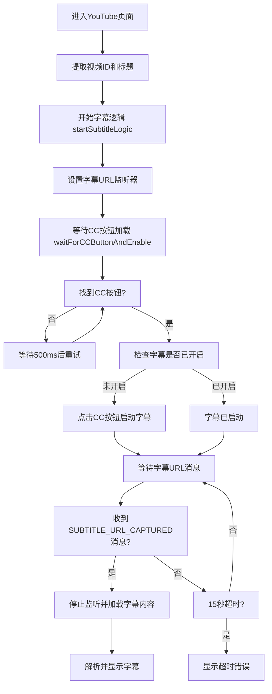

```mermaid
graph TD
    A[进入YouTube页面] --> B[提取视频ID和标题]
    B --> C[开始字幕逻辑 startSubtitleLogic]
    C --> D[设置字幕URL监听器]
    D --> E[等待CC按钮加载 waitForCCButtonAndEnable]
    E --> F[找到CC按钮?]
    F -->|否| G[等待500ms后重试]
    G --> F
    F -->|是| H[检查字幕是否已开启]
    H -->|未开启| I[点击CC按钮启动字幕]
    H -->|已开启| J[字幕已启动]
    I --> K[等待字幕URL消息]
    J --> K
    K --> L[收到SUBTITLE_URL_CAPTURED消息?]
    L -->|是| M[停止监听并加载字幕内容]
    L -->|否| N[15秒超时?]
    N -->|否| K
    N -->|是| O[显示超时错误]
    M --> P[解析并显示字幕]
```