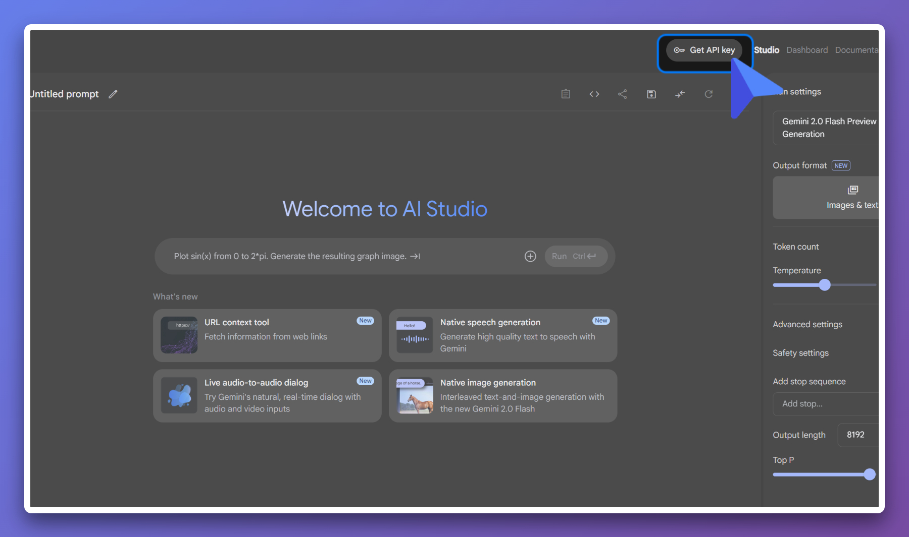
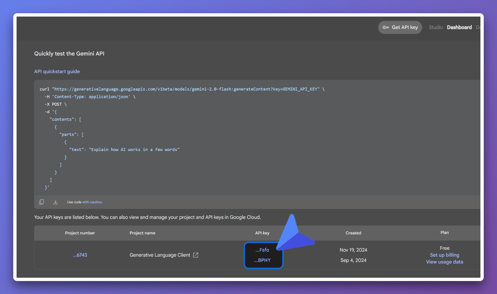
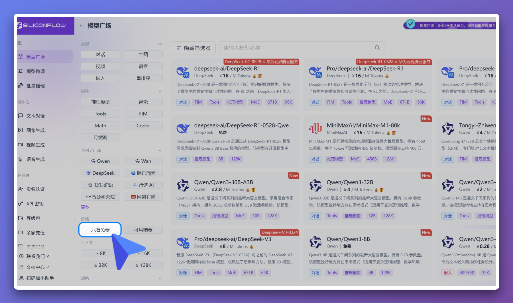
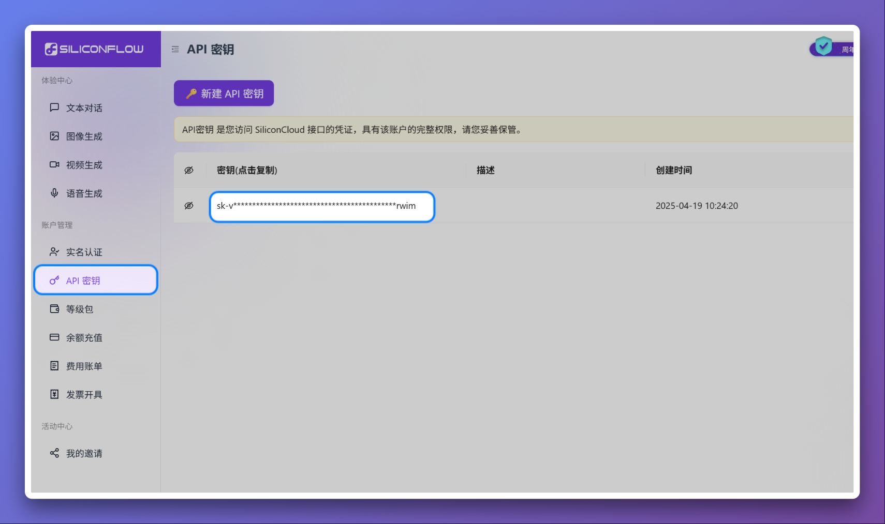

# AI 服务使用指引

本插件支持多种AI服务来生成视频字幕的智能总结。以下是推荐的AI服务选择和配置指南。

## 🌟 免费方案

### 1. 首选：Google Gemini（免费）

**推荐理由：**

- ✅ 部分可免费使用
- ✅ 性能优秀，总结质量高
- ✅ 支持长文本处理
- ✅ 响应速度快

**获取方式：**

1. 访问 [Google AI Studio](https://aistudio.google.com/)
2. 使用Google账号登录
3. 创建API Key
4. 在插件配置中选择"Google Gemini"并填入API Key

### 2. 备选：硅基流动（部分免费）

**适用场景：** 当网络无法访问Google服务时

**推荐理由：**

- ✅ 国内可直接访问
- ✅ 部分小模型免费使用
- ✅ 支持多种开源模型
- ⚠️ 速度相对较慢

**获取方式：**

1. 访问 [硅基流动](https://cloud.siliconflow.cn/)
2. 注册账号并完成认证
3. 获取API Key
4. 在插件配置中选择"自定义"，填入硅基流动的API地址和Key

### 3. OpenRouter

### 4. GPT_API_free

https://github.com/chatanywhere/GPT_API_free

## 💰 付费方案

### 3. OpenAI GPT系列

**特点：**

- 🚀 业界领先的AI能力
- 🎯 总结准确度极高
- 💡 支持复杂推理
- 💰 按使用量付费

**推荐模型：**

- `gpt-4o-mini`（性价比最高）
- `gpt-4o`（最强性能）

### 4. Anthropic Claude

**特点：**

- 📚 擅长长文本理解
- 🎨 输出格式优美
- 🛡️ 安全性高
- 💰 按使用量付费

**推荐模型：**

- `claude-3-haiku`（速度快，成本低）
- `claude-3-sonnet`（平衡性能与成本）

## 🔧 配置步骤

1. **打开配置页面**

   - 点击插件图标 → "配置AI总结"
   - 或右键插件图标 → "选项"

2. **选择AI服务商**

   - 推荐首选"Google Gemini"
   - 网络受限时选择"自定义"配置硅基流动

3. **填写API配置**

   - 输入对应的API Key
   - 自定义服务需填写API地址

4. **选择模型**

   - Gemini: 选择 `gemini-pro`
   - 硅基流动: 选择免费的小模型

5. **启用功能**
   - 确保"启用AI总结"开关打开
   - 保存配置

## 🚨 注意事项

### 隐私安全

- API Key仅存储在本地浏览器
- 字幕内容仅在总结时发送给AI服务
- 不会收集用户个人信息

### 使用限制

- 各服务商都有使用频率限制
- 免费服务可能有每日配额
- 网络状况影响响应速度

### 故障排除

- API Key错误：检查Key是否正确复制
- 网络超时：尝试更换网络或服务商
- 配额用尽：等待重置或升级付费计划

## 📞 获取帮助

如果在使用过程中遇到问题：

1. 查看浏览器控制台错误信息
2. 检查API服务商的状态页面
3. 尝试更换其他AI服务商
4. 在项目GitHub页面提交Issue
